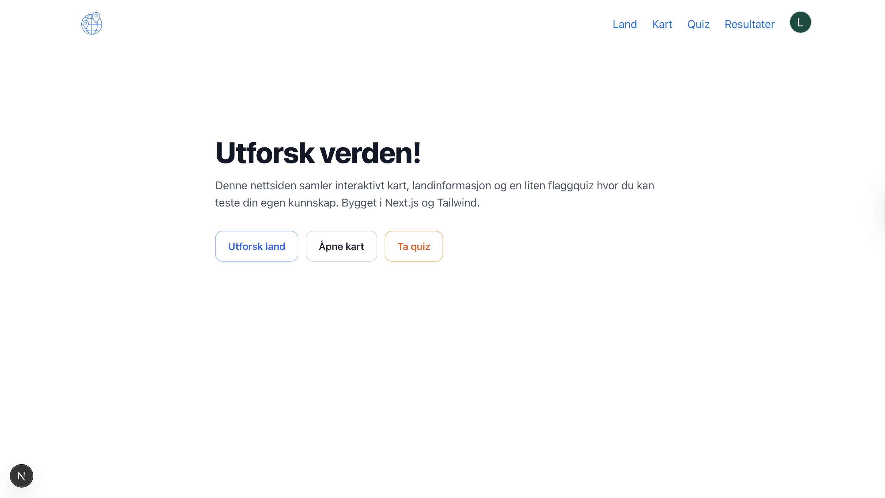
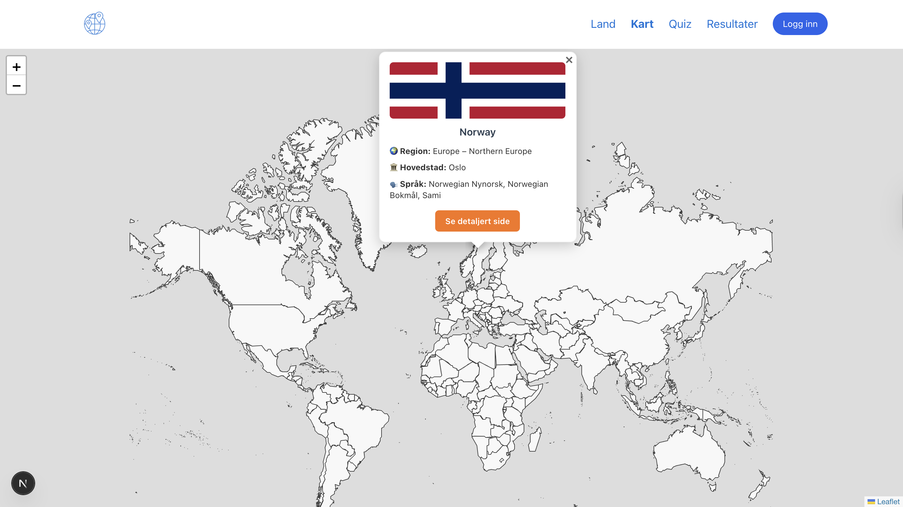

# Interaktivt kart, landinformasjon og flaggquiz

En Next.js-app som kombinerer:
- **Interaktivt verdenskart** (Leaflet/React-Leaflet) med GeoJSON-grenser og popups.
- **Landdetaljer** (REST Countries API) med dynamiske sider og kart pr. land.
- **Flaggquiz** med tre vanskelighetsgrader – resultater lagres per bruker.
- **Innlogging med Google** (NextAuth) og **persistens i Postgres via Prisma**.

> Bygget for å demonstrere fullstack-kompetanse: datahenting, app-router, serverløse API-ruter, autentisering/sesjon, klientside-kart uten SSR-problemer, og en ryddig UI med Tailwind.

## Hovedfunksjoner

- **Landoversikt og detaljer**
  - På `/countries` får du opp en liste med alle land (med flagg og navn).  
  - Klikker du på et land, åpnes en egen side `/countries/[name]` med mer info som språk, valuta, tidssoner og et kart som viser landet.

- **Verdenskart**
  - På `/map` kan du utforske et interaktivt kart over hele verden.  
  - Du kan holde musepekeren over land for å se navn, og klikke for å få opp flagg og en snarvei til landets side.

- **Flaggquiz**
  - På `/quiz` kan du teste deg selv i en quiz med 10 spørsmål.  
  - Du kan velge vanskelighetsgrad (lett, medium, vanskelig), og når du er ferdig får du poengsummen din.  
  - Hvis du er innlogget, lagres resultatet ditt automatisk.

- **Resultater**
  - På `/quiz/results` kan innloggede brukere se en oversikt over sine tidligere resultater (dato, nivå, poeng og tid brukt).

- **Innlogging**
  - Det er mulig å logge inn med Google.  
  - Da kan du lagre og hente resultater som knyttes til din bruker.

## Teknologistack

- **Frontend:** Next.js (App Router), React, TypeScript, Tailwind CSS
- **Kart:** Leaflet + React-Leaflet, OpenStreetMap, GeoJSON
- **Auth:** NextAuth (Google provider, Prisma adapter)
- **Database:** Postgres (Prisma ORM)

## Demo-bilder 

**Hjemside**

**Land**

**Kart**

  
  
  

**Quiz**

  
  
  

**Resultater**

  
  

**Logg inn med Google Authenticator**

## Demo av nettsiden
